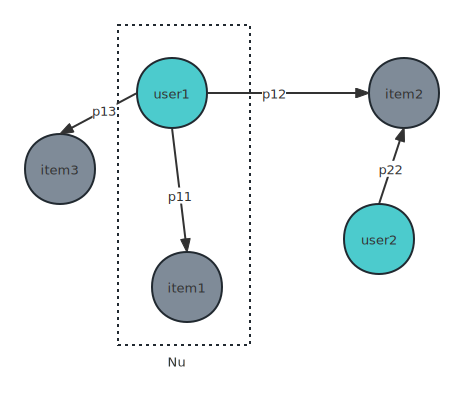
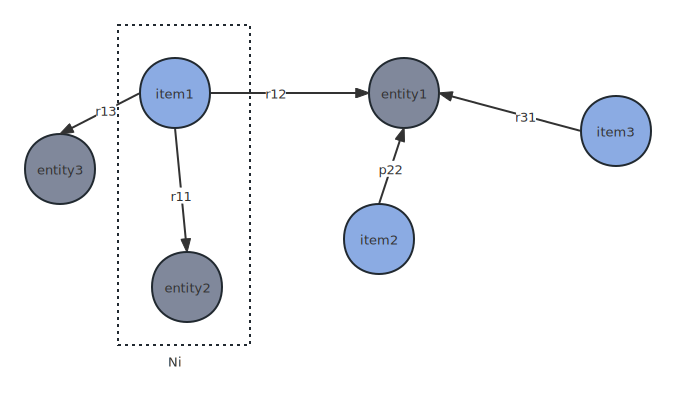
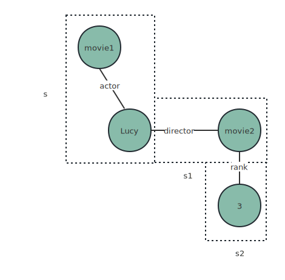

### KIGN

[论文](https://dl.acm.org/doi/10.1145/3442381.3450133)

[github](https://github.com/huangtinglin/Knowledge_Graph_based_Intent_Network)

本篇论文建立了知识图谱和用户-项目子图，并在聚合层有所创新

#### 问题

目前的研究存在的问题：

（1）没有在更细的用户意图上考虑用户项目之间的关系

（2）目前的信息聚合方案大多是基于节点的，即从相邻节点收集信息，而不考虑信息来自哪些路径，这种基于节点的方案不足以捕获关系之间的相互作用

#### KGIN模型

针对上面的问题，本篇论文提出了KGIN模型，在两个方向上创新：

1. 用户意图建模：将每个意图与KG关系的分布相关联，以考虑关系组合的重要性，重要关系被分配更大的归因分数；并且保证意图之间是相互独立的，这样可以提高可解释性。
2. 关系路径感知聚合：将关系路径视为信息通道，并将其嵌入到表示向量中

#### 问题定义

Interaction Data
$$
O^{+}  = {(u,i)|u ∈ U,i ∈ I}
$$
KG
$$
G = \{(h,r,t)|h,t ∈ V,r ∈ R\}
$$
task： 已知O+和G，训练一个函数可以预测用户选择某个item的可能性

#### 方法

1.用户意图建模

定义P是所有用户意图集合，u代表user，i代表item，意图网络IG可表示为：
$$
IG:  \{(u,p,i)|p ∈ P\}
$$

将每个intent和KG中的关系关联起来，并且用一个注意力分数来量化每个意图的重要性，意图嵌入表示为：
$$
e_{p}=\sum_{r\in R}^{} α(r,p)e_{r}
$$

α(r,p) 是一个分数函数，代表该意图的重要性，具体公式是：
$$
α(r,p)=\frac{e^{(w_{rp} )} }{ {\textstyle \sum_{r'\in R}^{}} e^{(w_{r′p})} }
$$
wrp是一个可训练的权重值，表示r、p的权重，这里为了方便起见用一个权重表示，*这个可训练的权重值是未来的探索方向*

每个intent应该是相互独立的，即一个intent不应该能被另一个intent推出来，这里提供了两个方式来保证独立性：

- 交互信息：用对比学习（contrastive learning）的思想解决
  $$
  L_{IND}  =\sum_{p∈P}^{} -log\frac{e^{\frac{s(e_{p} , e_{p}  )/\tau }{\tau } } }{ {\textstyle \sum_{p'\in P}^{}} e^{\frac{s(e_{p} , e_{p'}  )/\tau }{\tau } } }
  $$
  s是余弦相似度，*τ*是softmax函数中的参数

- 距离相关性：度量任意两个变量的线性和非线性相关性，当且仅当这些变量是相互独立时，系数为0
  $$
  L_{IND}  =\sum_{p,p'\in P,p\ne p'}^{} dCor(e_{p} ,e_{p'} )
  $$
  dCor函数表示意图p和意图p'的距离相关性，具体公式是：
  $$
  dCor(e_{p} ,e_{p'} )=\frac{dCov(e_{p} ,e_{p'} )}{\sqrt{dVar(e_{p} )\times dVar(e_{p'} )} }
  $$
  dCov表示距离的协方差，dVar表示距离的方差

  2.聚合层

  基于节点的聚合方式有以下两点的问题：

  - 不考虑不同路径的影响
  - 没有以明确的方式捕捉关系之间的依赖关系

  本篇论文提出了一种基于路径的关系感知聚合方式

  首先，在IG上的聚合：eu1表示user
  $$
  e_{u}^{(1)}=f_{IG}{\{(e_{u}^{(0)},e_{p} ,e_{i}^{(0)})|(p,i)\in N_{u} \}}
  $$

  $$
  f_{IG}=\frac{1}{|N_{u} |} \sum_{(p,i)\in N_{u}}^{} \beta (u,p)e_{p} \odot e_{i}^{0}
  $$

  其中，eu0表示的是user的embeding Id，ei0表示的是item的embedding id，ep是上文中的意图嵌入，Nu表示的user的一阶连接，*β*函数是一个分数函数，表示该intent的重要性，β的具体公式如下：
  $$
  \beta (u,p)=\frac{e^{(e_{p}^{T}e_{u}^{0}  )} }{\sum_{p'\in P}^{}e^{(e_{p'}^{T} e_{u}^{0} )}  }
  $$
  

  KG上的聚合：ei1表示item
  $$
  e_{i}^{(1)}=f_{KG}{\{(e_{i}^{(0)},e_{r} ,e_{v}^{(0)})|(r,v)\in N_{i} \}}
  $$

  $$
  f_{KG}=\frac{1}{|N_{i} |} \sum_{(r,v)\in N_{i}}^{} e_{r} \odot e_{v}^{0}
  $$

  其中er表示关系r的嵌入，ev0表示实体v的embedding id，Ni表示item的一阶连接

  

聚合

l阶用l-1阶表示
$$
e_{u}^{l}=f_{IG}(\{(e_{u}^{l-1},e_{p} ,e_{i}^{l-1})|(p,i)\in N_{u} \})
$$

$$
e_{i}^{l}=f_{KG}(\{(e_{i}^{l-1},e_{r} ,e_{v}^{l-1})|(r,v)\in N_{i} \})
$$

eil可以改写为下面公式：
$$
e_{i}^{l}=\sum_{s\in N_{i}^{l} }^{}\frac{e_{r1} }{|N_{s1} |}  \odot \frac{e_{r2} }{|N_{s2} |}\odot ...\odot \frac{e_{rl} }{|N_{sl} |}\odot e_{sl}^{0}   
$$
s表示已item为更的l跳路径，s包含连接的三元组序列，如下：

#### 模型预测

$$
e_{u}^{*}= e_{u}^{0}+...+e_{u}^{l}
$$

$$
e_{i}^{*}= e_{i}^{0}+...+e_{i}^{l}
$$

两者的乘积表示用户选择该项目的概率
$$
\hat{y} _{ui} ={e_{u}^{*}} ^{T} e_{i}^{*}
$$
